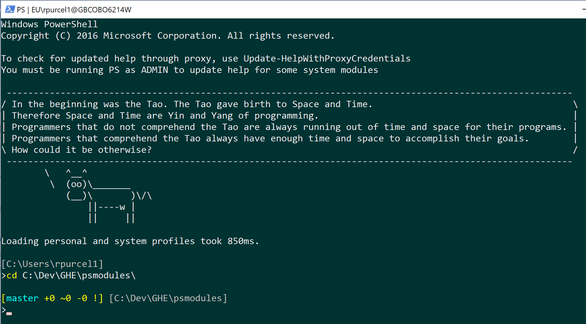
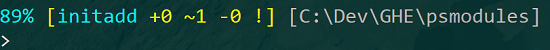

# psmodules
PowerShell modules and profile stuff

Some are mine, some I've pulled together from blogs and sample code.

I've lost the details of where they came from, so if you see this and think "that's mine!", I appologise.

# Installation
The files in `psfiles` should be placed in: `~\Documents\WindowsPowershell`, or `~\Documents\Powershell` if using PS Core (6+).
They will be loaded automatically on starting a PS session.

You can replace your current `Microsoft.PowerShell_profile.ps1` file, or add parts from the one here to your existing one.
This profile uses gitutils.ps1, Get-Fortune and Write-CowSay, and creates aliases for Write-Note, Show-Note and AddCommitPushGit.

# Annoying things
You'll need to unblock the scripts after downloading, as Windows knows they come from the internet, which is bad.
Right-click > properties on each .ps* file (do a search in the directory for .ps to find them all) and tick the box.

You may also need to set your script execution policy to allow these to run, because they aren't signed.

To do that, run this from an ADMIN PS prompt: `Set-ExecutionPolicy RemoteSigned`

You should probably also read up on what the execution policy setting does :)

# PS prompt
The format of the PowerShell prompt is set by the text returned from the call to the `prompt` method, which has a default
of `"PS $((Get-Location).Path)>"`.

The `Microsoft.PowerShell_profile.ps1` script overrides the method to generate a more useful prompt on two lines.
It shows: remaining battery level if less than 100%, in various colours depending on level; compact git status if
in a git repo directory; and the current directory.

Here, my battery is at 89%. I'm in the folder `c:\dev\GHE\psmodules`, which is a git repo. In that repo, I'm on
the `initadd` branch, with 0 added(+), 1 modified(~), 0 deleted(-) files, with some new files not yet added to commit (!).
If this branch was tracking a remote branch, I'd also get shown if my branch is ahead/behind the remote after I fetch.

# Helpful stuff
## gitutils.ps1
This is a set of helper methods for getting info from git in the current directory.

Used here to add git info to the PS prompt.

## AddCommitPushGit
Bad practice, but good enough for me working on personal stuff. Add, commit and push in the current git
repo, taking the commit message as a parameter. Aliased as `acp`.

# Modules
## Set-UseSystemProxy
Simple module which sets the current PS session to use the system proxy settings, by creating
a System.Net.WebClient with DefaultNetworkCredentials.

These settings are then used automatically
by any other WebClients created in the session, unless set otherwise explicitly.

## Update-HelpWithProxyCredentials
Update the Powershell help, using the default network credentials for the proxy for help file download.

You will need to run this as admin to update system module help.

## Clear-SavedHistory
For clearing up anything you've typed in a PS session that you don't want accessible later in history.

Powershell has the Clear-History command, which clears the PS session command history.

This doesn't clear the console host history, or the saved PS command history.

This module provides `Clear-SavedHistory`, which clears the screen, the session history, **all** the saved history and the console host history.

## Write-Note
Take notes from the PS command-line. Pass a string as the only param, and it's written to a dated file in `~\Documents\Notes\`.

Also provides `Show-Note`, which opens the folder.

I also have aliases in the profile script mapping these two commandlets to `noteit` and `notes`, to make it a bit quicker.

## Get-Fortune
Now we're into the silly stuff. This one outputs a random fortune (a la UNIX fortune).

Fortunes are taken from the Tao of Programming and AI Koans.

If you want to add/replace fortunes, edit fortune.txt with a % on a line on it's own to separate them.

## Write-CowSay
More sillies. This writes a cow saying the text passed as input to the console (a la UNIX cowsay).
